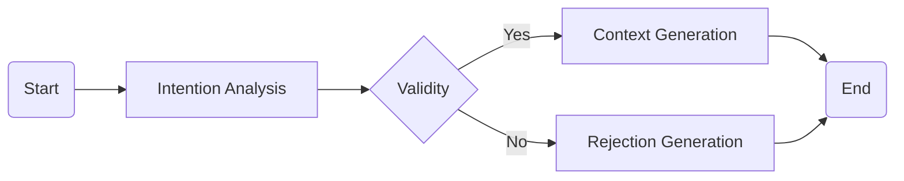

# 🏖️ Event Generator
This `demo` application interprets a variety of natural language queries to identify user needs and returns a list of appropriate venues, as a conceptual tool for event planners, businesses, and individuals seeking venues that meet specific criteria.
    

## 🚩 Features
- `Natural Language Query Processing` -- Extract intuitive queries like "Muslim Friendly Salon" or "Fusion Peranakan Cuisine places" as high-level  intentions for process.

- `Dynamic Venue Search` -- Supports diverse queries across different business related domains including event venues, services, and more.

- `Powered by LangChain` -- Leverages state-of-the-art Large Langauge Models (LLM) through flexi integration framework, LangChain, for understanding and processing of request queries and generating relevant results.

- `Highly Customizable` -- Easily extendable to accommodate additional filters and data sources tailored to specific industries or user needs.

## 🚥  Flowchart


*Flowchart illustrates internal processing steps of an API from receiving a query to the final response.*

    🔵 Start: API receives the incoming query from the user. 
    
    🔲 Intention Analysis: Analyzes the user's intent, attempting to discern what the user is seeking.

    🔶 Validity: A decision point to evaluate whether the query is valid and processable, then diverts the flow to two alternative process results.

    ✔️ Yes: If the query is valid, the system proceeds to Context Generation.
    ✖️ No: If the query is invalid, the system moves to Rejection Generation.

    🔲 Context Generation: Relevant context or structured results are generated based on the user's input.

    🔲 Rejection Generation: Rejection response is generated as a graceful fallback to inform the user.

    🔴 End: The process concludes with either the generated response or rejection message.

## 🚧 Sequence
Sequence diagram shows *two* sets of plausible requests as described below:

 ```mermaid
 sequenceDiagram
    Client->>Server: "Birthday Party Venues for children"
    Server-->>Azure: `Validate Intention`
    Azure-->>Server: ( Response )
    Server-->>Server: Route
    Server-->>Azure: `Context Generation`
    Azure-->>Server: ( Response )
    Server->>Client: [{ JSON 1, JSON 2, ... }]

    Client->>Server: "Hitman for Hire"
    Server-->>Azure: `Validate Intention`
    Azure-->>Server: ( Response )
    Server-->>Server: Route
    Server-->>Azure: `Rejection Generation`
    Azure-->>Server: ( Response )
    Server->>Client: "This response is not applicable due to ..."
 ```

## 📚 Challenges & Design
1. *Intention Analysis*:
    - (Challenge) Accurately interpreting user intent, especially with ambiguous or unstructured queries.
    - (Design) Leveraging Large Langauge Models (LLM) on Natural Language  queries to handle diverse user inputs, including variations in phrasing and context.

2. *Validity Check*:
    - (Challenge) Ensuring the query is valid and meaningful without ambiguity.
    - (Design) Implementing pseudo rule-based LLM prompt checks to determine query validity, ensuring it fits within the system's operational scope.

3. *Context Generation vs. Rejection*:
    - (Challenge) Deciding when to generate a valid response versus when to reject a query due to insufficiency or ambiguity.
    - (Design) Incorporating fallback mechanisms and providing clear rejection messages or clarification requests to guide users toward reformulating their queries.

4. *Performance Optimization*:
    - (Challenge) Minimizing response times during intention analysis, validity checks, and context generation, especially with complex or lengthy queries.
    - (Design) Utilizing lightweight prompts, parser techniques, low-weight models to ensure fast, reliable responses without compromising on quality of generation.

5. *Scalability*:
    - (Challenge) Ensuring the system to be operated as standalone module and dynamical in prompt design to fit or alterate in instructive format.
    - (Design) Designing for standalone scalability through RESTful framework, paired with LangGraph supported node-based framework for reusability.

## 📝 Setup
- To initialize this application, follow these `steps`:
```bash
# Open a Terminal (Command Prompt or PowerShell for Windows, Terminal for macOS or Linux)

# Ensure `Git` is installed
# Visit https://git-scm.com to download and install console Git if not already installed

# Ensure `Docker` is installed
# Visit https://www.docker.com/get-started to download and install Docker if not already installed

# Clone the repository
git clone https://github.com/saioru/Event-Generator.git

# Navigate into the repository, clone and rename `.env.sample` as `.env`
cp .env.sample .env

# Add relevant cloud provider API credentials as stated in `.env`
OPENAI_API_VERSION= # NOTE: (2024-08-01-preview and later)
AZURE_OPENAI_ENDPOINT=
AZURE_OPENAI_API_KEY=
LLM_MODEL= # Model `Deployment` Name as stated in Azure portal

# Run docker build and run API in container service (Make sure port `8000` is not occupied)
docker build -t demo-image . && docker run -d -p 8000:8000 demo-app
```

- To test this application, *import* the provided `test_scripts.postman_collection` into **Postman** and execute test scripts. 

## ⭕ Remarks
> Each inference cycle for this application is expected to cost more than 1000 in total tokens, which may vary in speed based on the [Azure's subscription tiers](https://learn.microsoft.com/en-us/azure/ai-services/openai/quotas-limits#other-offer-types).
